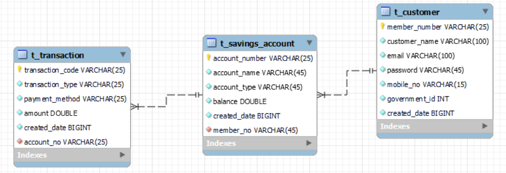

#  Savings Management - Spring Boot API for a simple savings system.
   +  This API provides a simple savings system, allowing users to create savings accounts, deposit and withdraw funds, check their account balance, and view transaction history.

   +   Objectives
       +  Implemented endpoints to capture a list of customers, including their bio data
       +  Implemented endpoints to record savings transactions per customer, including transaction details such as transaction ID, date, payment method, and amount.
       +  Implemented endpoints to track the total savings amount for each person.
       +  Implemented endpoints to track the total savings amount received across all users
       +  Implemented endpoints to create and manage multiple savings products, such as Education Savings, Personal Savings, and Vacation Savings.
       +  Ensured proper error handling and validation of incoming requests.
       +  Implemented unit tests to validate the functionality of the API endpoints.

   +   Technologies Used
       +  Spring Boot 3
       +  Spring Data JDBC/JPA
       +  MySQL on Docker
       +  TestContainers for DAO Layer unit testing
       +  Lombok
       +  Spring Boot DevTools
       +  Hibernate Validator
       +  Spring Security
       +  Flyway for seamless database migrations
       +  Tiara Connect SMS Gateway [https://www.tiaraconnect.io/]
     
   +    Features
        +  Customer Management
           +  Create customer
           +  Update customer details
           +  Delete customer
           +  View customer
        +  Account Management
           +  Create Account
           +  Update Account details
           +  Delete Account
           +  View Account
        +  Payment/Transaction Management
           +  Record payment (positive adjustment)
           +  Negative adjustment
           +  View Payment
        +  Notification Service
           +  sms notification - integrated Tiara Connect
  +    TODO
       +  Implement Testing
       +  Implement Security
       +  Document the APIs using both Postman and Swagger, providing clear descriptions and examples for each endpoint.
       +  Notification Service
          +  email notification